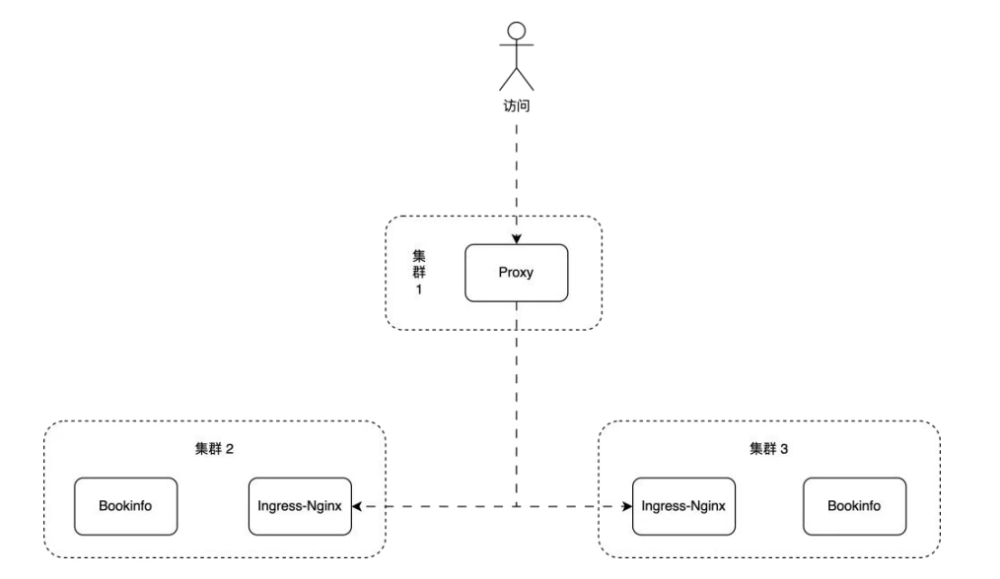

# 极客时间 | 云原生 DevOps 进阶实战营 | 大作业

## 1. 要求与备注

### 1.1 要求

- 使用 Terraform 开通一台腾讯云 CVM 并安装 K3s (`集群-1`) 并在 `集群-1` 内安装 Jenkins, ArgoCD
- 使用 Terraform 开通两台腾讯云 CVM 并分别安装 K3s (`集群-2`, `集群-3`) 并实现以下要求:
  - 使用 `集群-1` 作为 Terraform Kubernetes Backend 后端存储
  - 将 IaC 源码存储在 GitHub 代码仓库中
  - 在 `集群-1` 作的 Jenkins 中配置流水线实现在 IaC 代码变更时自动触发变更 `Jenkinsfile`
- 在 `集群-1` 的 ArgoCD 实例中添加 `集群-2`, `集群-3`
- 使用一个 `ApplicationSet` + `List Generators` 在 `集群-2`, `集群-3` 内的 `default` 命名空间下同时部署示例应用 `BookInfo` (Helm 源码见: `iac/lastwork/bookinfo`)
- 示例应用部署完成后, 实现以下架构:

### 1.2 备注

- 这是一个理想的多云灾备部署场景, `集群-1, 2, 3` 可能分别部署在不同云厂商
- `集群-1` 的 Proxy 作为流量入口对外提供服务, 并对部署在 `集群-2`, `集群-3` 的无状态示例应用 `BookInfo` 做负载均衡

---

## 02 | 实现与运行
